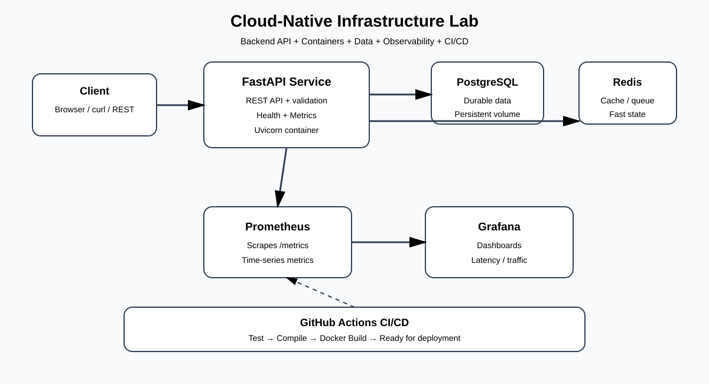
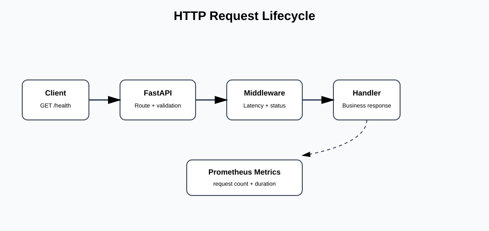

# Joseph Projects — Developer-Focused & Infrastructure Portfolio

> Senior-level backend, cloud, DevOps and infrastructure engineering projects by **Joseph Muhiya**.

## Featured Project: Cloud-Native Infrastructure Lab

A production-style reference implementation demonstrating how a backend service can be designed, containerised, tested, monitored and delivered through CI/CD.

### Engineering focus

- Backend API development with **Python + FastAPI**
- RESTful health and service endpoints
- **PostgreSQL** persistence
- **Redis** caching layer
- Docker and Docker Compose container orchestration
- Prometheus metrics and Grafana observability
- Automated testing with pytest
- GitHub Actions CI pipeline
- Infrastructure-as-code concepts and reproducible environments
- Operational readiness: health checks, environment configuration, logging and monitoring
- Architecture documentation using SVG system diagrams

### Architecture



### Request flow



## Why this project matters

This repository is intentionally more than a CRUD demonstration. It models the engineering lifecycle used in backend and DevOps environments:

**Design → Develop → Test → Containerise → Observe → Automate → Operate**

The project is suitable as a portfolio reference for **Backend Developer, Python Developer, Software Engineer, DevOps Engineer, Cloud Engineer, Site Reliability Engineer (SRE), Infrastructure Engineer and Platform Engineer** roles.

## Technology stack

| Layer | Technology |
|---|---|
| API | Python, FastAPI, Uvicorn |
| Database | PostgreSQL |
| Cache | Redis |
| Containers | Docker, Docker Compose |
| Observability | Prometheus, Grafana |
| Testing | Pytest, FastAPI TestClient |
| CI/CD | GitHub Actions |
| Documentation | Markdown, SVG architecture diagrams |

## Project structure

```text
.
├── app/
│   └── main.py
├── tests/
│   └── test_api.py
├── docs/
│   ├── architecture.svg
│   └── api-flow.svg
├── monitoring/
│   ├── prometheus.yml
│   └── grafana-dashboard.json
├── .github/workflows/ci.yml
├── .env.example
├── .gitignore
├── Dockerfile
├── docker-compose.yml
├── requirements.txt
└── README.md
```

## Run locally

```bash
git clone https://github.com/Mjmuhiya/Joseph-projects.git
cd Joseph-projects
docker compose up --build
```

Services:

- API: `http://localhost:8000`
- Swagger/OpenAPI: `http://localhost:8000/docs`
- Health: `http://localhost:8000/health`
- Metrics: `http://localhost:8000/metrics`
- Prometheus: `http://localhost:9090`
- Grafana: `http://localhost:3000`

Run tests locally with `python -m pip install -r requirements.txt` followed by `pytest -q`.

## API

`GET /health` returns service health. `GET /api/v1/info` returns non-secret service metadata for operational diagnostics. `GET /metrics` exposes Prometheus-compatible metrics.

## Observability

The application exposes metrics for request volume, latency and process health. Recommended production extensions include OpenTelemetry tracing, structured logging, alert rules, managed PostgreSQL/Redis, Kubernetes with Helm, cloud secret management and blue/green or canary deployment.

## Security principles

No credentials are hard-coded. Runtime configuration is supplied through environment variables. A production deployment should additionally implement secret rotation, least-privilege database accounts, TLS, dependency scanning, container image scanning, API authentication and network segmentation.

## SEO / discoverability keywords

**Backend Developer Portfolio, DevOps Projects, Cloud Engineering Portfolio, Python FastAPI, REST API, Docker, Docker Compose, PostgreSQL, Redis, Prometheus, Grafana, GitHub Actions, CI/CD, Infrastructure Engineering, Site Reliability Engineering, SRE, Platform Engineering, Cloud-Native Applications, Microservices, Observability, Monitoring, Automated Testing, Software Engineering, Infrastructure as Code, Backend Engineering, Python Developer, DevOps Engineer, Cloud Engineer.**

## Engineering roadmap

- [x] Containerised backend service
- [x] Automated tests
- [x] CI workflow
- [x] Prometheus metrics
- [x] Grafana dashboard configuration
- [x] Architecture documentation
- [ ] Kubernetes manifests
- [ ] Helm chart
- [ ] OpenTelemetry tracing
- [ ] Terraform cloud infrastructure
- [ ] Secure API authentication
- [ ] Production deployment

## Author

**Joseph Muhiya** — IT professional, software engineer and programming lecturer focused on backend engineering, cloud technologies, testing, optimisation and technical training.

- GitHub: https://github.com/Mjmuhiya
- LinkedIn: https://www.linkedin.com/in/joseph-mastaki

---

This project is provided as a portfolio and learning reference. Production deployments require environment-specific security, scalability and compliance controls.